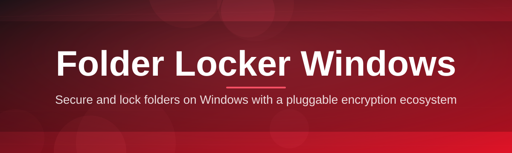

# folder-locker-manager 🔒🛡️

  

*A quiet little vault for your Windows folders — lock them up, keep them private, get on with your day.*

  

| Requirement | Details |
|---|---|
| **Operating System** | Windows 10 (64-bit) or Windows 11 |
| **Disk Space** | ~45 MB free |
| **Memory** | 512 MB RAM minimum |
| **Dependencies** | None — fully standalone |
| **.NET Runtime** | Not required (self-contained build) |
| **Admin Rights** | Recommended for system folder locking |

---

## 📖 Overview

Ever had that one folder — tax documents, personal photos, a side project you're not ready to show anyone — sitting right there in plain sight on your desktop, one accidental double-click away from a friend, sibling, or coworker who's "just borrowing your laptop for a second"? That's the itch **folder-locker-manager** scratches. It's a Windows folder locker built for regular people who want a simple, visual way to hide and password-protect folders without wrestling with permission dialogs or third-party bloatware.

We built this because most Windows folder locker tools out there fall into two camps: overengineered enterprise suites that need a manual to operate, or sketchy toolbars-in-disguise that plaster ads across your screen. **folder-locker-manager** sits comfortably in the middle — a lightweight, standalone Windows application that does exactly one job (locking and unlocking folders) and does it cleanly, with a modern interface that doesn't look like it escaped from 2009.

Whether you're a student sharing a family PC, a freelancer protecting client files, or just someone who values a little digital privacy, this tool is designed for you. No cloud accounts, no telemetry, no subscription nags — just a Windows folder locker that respects your time and your data.

> [!NOTE]
> The download links above and below both point to the official project landing page, where you'll always find the current build for Windows.

---

## 🧩 What It Actually Does

Here's the feature grid — think of it as the tool's resume, laid out side by side so you can scan it in ten seconds.

| Capability | What It Brings To The Table |
|---|---|
| **Password-Gated Vaults** | Turn any folder into a locked vault protected by a master password you choose — no cloud sync, no accounts required. |
| **Instant Hide Mode** | Make folders vanish from Explorer entirely, rather than just marking them "protected," for an extra layer of low-key privacy. |
| **Drag-and-Drop Locking** | Drag a folder straight onto the app window and it's queued for locking — no digging through nested context menus. |
| **Batch Operations** | Lock or unlock a whole batch of folders in one pass instead of repeating the same clicks over and over. |
| **Stealth Launch** | Start minimized to the system tray so the app itself doesn't announce what you're protecting. |
| **Auto-Relock Timer** | Folders automatically re-lock after a period of inactivity, so a forgotten unlocked folder doesn't stay exposed all day. |
| **Portable Mode** | Run the entire app from a USB drive without leaving traces or requiring installation on the host machine. |
| **Activity Log** | A local, private log of lock/unlock events — helpful for peace of mind, useless to anyone but you since it never leaves your PC. |
| **Light & Dark Themes** | A visual switch that matches whatever mood (or monitor brightness) you're working in. |
| **Master Password Recovery** | A security-question-based recovery flow so a forgotten password doesn't mean a permanently locked folder. |

> [!TIP]
> Pair **Auto-Relock Timer** with **Stealth Launch** if you're on a shared computer — the app disappears into the tray and locks itself back up even if you forget.

---

## 🚀 Getting Started

Getting up and running takes about two minutes. Here's the whole journey:

1. **Visit the landing page** using the download button on this page — that's the only place we distribute builds from.
2. **Download the installer** (or portable ZIP, if you prefer no footprint on the system).
3. **Run the executable** — Windows SmartScreen may ask for confirmation the first time; that's normal for independently distributed apps.
4. **Set your master password** on first launch, then start dragging folders in to lock them.

> [!IMPORTANT]
> Choose a master password you'll actually remember. There is no backdoor "bypass" for a lost password beyond the built-in recovery questions — that's the whole point of a real lock.

---

## 🖥️ System Requirements

<strong>Click to expand full requirement breakdown</strong>

1. Windows 10 (version 1809 or later) or Windows 11, 64-bit only.
2. No .NET, Java, or Python runtime installation needed — everything ships self-contained.
3. A minimum of 45 MB of free disk space for the standard install; portable mode needs roughly the same on your USB drive.
4. Standard user account works fine for personal folders; administrator rights are only needed if locking folders inside system-protected directories.
5. No internet connection required after download — the app runs fully offline.

  

---

## ⚙️ How It Works

Under the hood, the workflow is intentionally simple — no exotic drivers, no kernel-level trickery. Here's the short version:

1. You select or drag a folder into the app.
2. The app encrypts folder metadata and reroutes access through its own protected index.
3. Your master password acts as the key that unseals that index.
4. On unlock, the folder is restored to its original path and made visible again.
5. If the Auto-Relock Timer is active, the whole cycle quietly repeats in reverse after a period of idle time.

> [!WARNING]
> Moving or renaming a locked folder's parent directory *outside* the app can confuse the index. Always lock and unlock through folder-locker-manager itself, not through raw file operations.

---

## 🔧 Troubleshooting

1. **Q: My folder disappeared after locking — is it gone?**
   A: No — it's intentionally hidden as part of the Instant Hide Mode. Reopen the app and unlock it from your vault list to restore it.

2. **Q: I forgot my master password. Now what?**
   A: Use the recovery flow on the login screen, which relies on the security questions you set during first launch. There is no manual override outside of this — that's what keeps the lock meaningful.

3. **Q: Windows SmartScreen flagged the installer. Is that expected?**
   A: Yes, this is common for independently distributed Windows software that hasn't accumulated enough download reputation yet. Verify you got it from the official landing page and proceed if you trust the source.

4. **Q: A locked folder shows 0 KB in Explorer. Did I lose my files?**
   A: Your files are intact inside the protected index; Explorer just can't read the redirected path while it's locked. Unlock it through the app to see everything again.

5. **Q: Can antivirus software interfere with locking/unlocking?**
   A: Occasionally, aggressive real-time scanners flag folder redirection as suspicious behavior. Whitelisting the app's install folder usually resolves this.

6. **Q: Does Auto-Relock work while the app is closed?**
   A: No — the timer runs while the app (or its tray process) is active. Fully quitting the app leaves folders in their last known state.

---

## 🎨 Interface & Experience

The interface leans minimal on purpose — a locker shouldn't compete for your attention.

| Shortcut | Action |
|---|---|
| `Ctrl + L` | Lock selected folder |
| `Ctrl + U` | Unlock selected folder |
| `Ctrl + Shift + H` | Toggle Stealth Launch |
| `Ctrl + ,` | Open Settings |
| `Esc` | Minimize to tray |

> [!TIP]
> Head into **Settings → Appearance** to toggle between Light and Dark themes, adjust the Auto-Relock interval, and configure whether the app starts with Windows.

Beyond the shortcuts, the Settings panel groups everything into three tabs — *General*, *Security*, and *Appearance* — so nothing feels buried three menus deep.

---

## 🤝 Contributing & Community

This project grows because people like you file issues, suggest features, and occasionally send in pull requests that make the whole thing better.

- Found a bug? Open an issue with your Windows version and repro steps.
- Have an idea for a new locking mode? Start a discussion thread before opening a big PR — saves everyone time.
- Prefer writing docs over code? Documentation improvements are just as welcome as feature work.

> [!NOTE]
> Please avoid submitting anything that repurposes this tool for accessing files you don't own or have permission to manage — it's built for personal folder privacy, not for circumventing anyone else's security.

---

## 📜 License